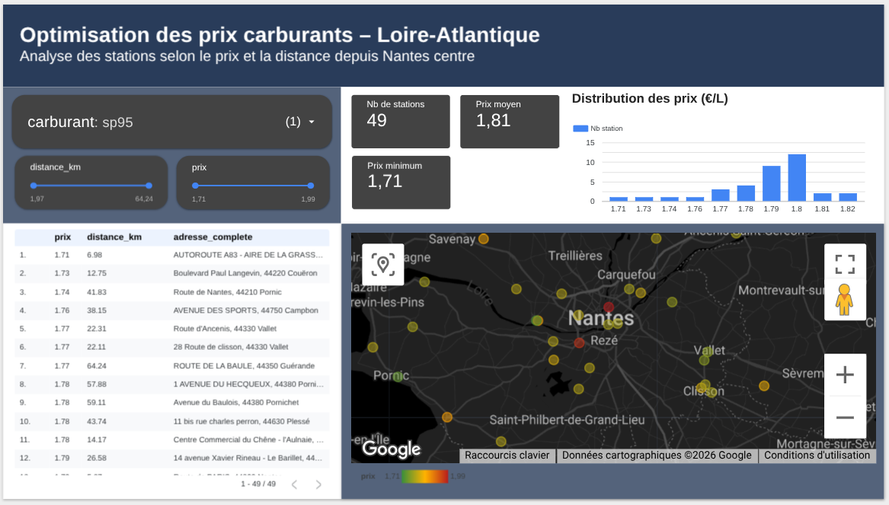

# Optimisation des prix carburants – Loire-Atlantique

Analyse des stations-service selon le prix et la distance depuis Nantes centre, à partir de données open data, avec BigQuery et Looker Studio.

## Objectif du projet

L’objectif de ce projet est d’identifier les stations-service les plus avantageuses en Loire-Atlantique en combinant deux dimensions :

- le prix du carburant
- la distance depuis un point de référence fixé à Nantes centre

Ce projet transforme un dataset open data brut en outil d’aide à la décision.

---

## Problématique business

Comment aider un utilisateur à trouver rapidement où faire le plein au meilleur prix, tout en tenant compte d’une contrainte de distance ?

---

## Stack utilisée

- Google Sheets
- BigQuery
- SQL
- Looker Studio

---

## Source de données

- Source : data.gouv.fr
- Dataset : Prix des carburants en France – flux instantané
- Périmètre retenu : Loire-Atlantique (44)

---

## Démarche du projet

### 1. Préparation initiale dans Google Sheets

J’ai commencé par simplifier le dataset brut dans Google Sheets afin de construire un MVP analytique.

Colonnes conservées :
- id_station
- code_postal
- adresse
- ville
- geom
- prix_gazole
- prix_sp95
- prix_e85
- prix_e10
- prix_sp98
- code_departement

Objectifs :
- réduire le bruit
- supprimer les colonnes non nécessaires
- préparer une base simple et lisible pour l’import dans BigQuery

---

### 2. Modélisation dans BigQuery

J’ai construit plusieurs couches analytiques :

#### `stg_carburants_44`
- filtrage sur le département 44
- parsing de `geom`
- création de `latitude` et `longitude`
- cast des colonnes prix en `FLOAT64`

#### `mart_carburants_44_avecGPS`
- création d’une `adresse_complete`
- ajout d’une ancre géographique : Nantes centre
- calcul de la distance entre chaque station et cette ancre

#### `v_mart_44_long`
- transformation du dataset du format large au format long
- création des colonnes `carburant` et `prix`
- préparation d’une structure compatible avec un filtrage dynamique dans Looker Studio

---

### 3. Contrôles qualité

J’ai réalisé plusieurs contrôles qualité :

- unicité des stations
- validation du parsing géographique
- cohérence des coordonnées
- détection de prix aberrants
- couverture des prix par carburant

Principaux résultats :
- 175 stations sur le périmètre
- 0 doublon
- 0 coordonnée invalide
- 0 prix aberrant
- couverture cohérente selon les carburants

---

### 4. Enrichissement géospatial

J’ai calculé la distance entre chaque station et un point de référence fixé à Nantes centre avec les fonctions géographiques de BigQuery.

Cela permet de passer d’une logique de simple comparaison de prix à une logique plus utile :
prix + distance.

---

### 5. Dashboard Looker Studio

Le dashboard final permet de :

- filtrer par carburant
- filtrer par distance
- visualiser la distribution des prix
- localiser les stations sur une carte
- identifier rapidement les stations les moins chères dans le périmètre sélectionné

---

## Structure du repository

- `google-sheets/` : logique de nettoyage et préparation MVP
- `sql/` : requêtes BigQuery
- `dashboard/` : présentation du dashboard
- `docs/images/` : captures du projet

---

## Résultats obtenus

Ce projet m’a permis de construire un pipeline complet :

- préparation des données
- contrôles qualité
- modélisation SQL
- enrichissement géospatial
- création d’un dashboard interactif

J’ai ainsi transformé une source open data brute en un outil d’aide à la décision centré sur le compromis prix / distance.

---

## Limites du projet

- données instantanées, sans historique
- distance théorique, non routière
- disponibilité réelle du carburant non intégrée dans le MVP
- périmètre limité à la Loire-Atlantique

---

## Améliorations possibles

- ajout d’un historique journalier
- calcul d’un score prix / distance
- recommandation automatique de la meilleure station dans un rayon donné

---

## Aperçu du dashboard

---

## Auteur

Projet réalisé par Antoine Gauthier
